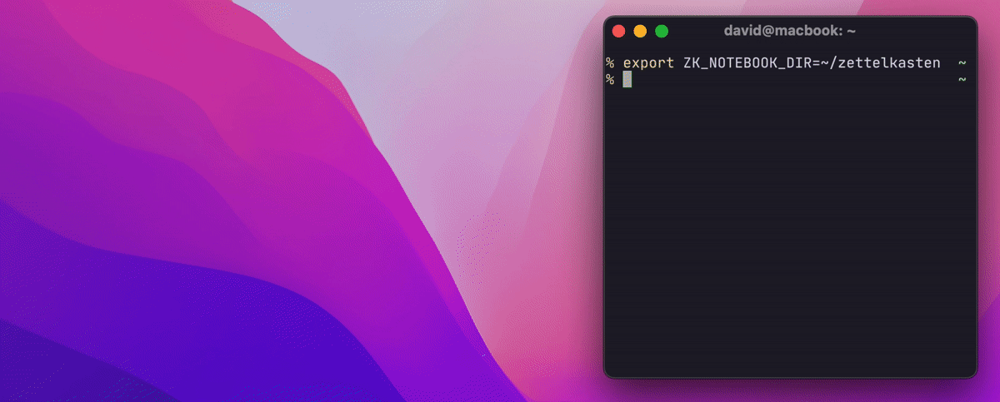

# Zettelkasten sketch

This is a script thet works in conjunction with [Mickael Menu's
zk](https://github.com/mickael-menu/zk) only for MacOs. It opens the iPad
continuous sketch and copies the file into a demanded folder in the slipbox.

## Installation

There are two scripts present `sketch.sh` and `sketch.scpt`. Copy both into the
scripts folder inside the `zk` config (I chose this folder here). Or simply
`make install`, which copies the two files.

Finally add the following alias to `.zk/config.toml`

```
sketch = "$ZK_NOTEBOOK_DIR/.zk/scripts/sketch.sh [-i] [-f assets] [-t 10m]"
```

Three options are possible to set:

- `-i` inverts the luminance of the sketch (for dark backgrounds)
- `-f` sets the folder of the assets (default `assets`)
- `-t` sets the timeout for waiting for the sketch (default `10m`)

Now the command `zk sketch` is available to you.

## Functioning principle

Unfortunately, the continous integration feature is not well documented for
developers. So I chose a rather extreme apporach, by controlling the Mac with
apple script. First Finder gets opened in the root dir, then applescript selects
the `asset` folder and opens the context menu, where it chooses `Import from iPad > Add sketch`.

The sketch-pad should open on the iPad. Draw your sketch and hit `Done`. The
file gets transferred into the `assets` folder. The sketch gets automatically
renamed and optinally luminance inverted for better contrast on dark
backgrounds.

The resulting file can be easily integrated by any zettels.

### Example

On the Mac 
On the iPad 

## Utilities

### Clean up unlinked assets

If you want to clean up unlinked sketches, add this alias to your
`.zk/config.toml`
```toml
clean_sketches = "s=`rg -I '!\\[.*\\]\\((.+\\.png)\\)' -r \"$ZK_NOTEBOOK_DIR/\"'$1' \"$ZK_NOTEBOOK_DIR\"` && find \"$ZK_NOTEBOOK_DIR/assets\" -type f | grep -v \"$s\" | xargs -I {} rm -v \"{}\""
```

### Neovim Integration

You probably want to call the function from vim and be able to insert the link
directly.

#### Requirements

- [neovim](https://github.com/neovim/neovim) > 0.5
- [plenery.nvim](https://github.com/nvim-lua/plenary.nvim) installed
- [zk-nvim](https://github.com/mickael-menu/zk-nvim) installed

Add this to your `zk-nvim` config for example

```lua
local commands = require "zk.commands"
local Job = require "plenary.job"

local function zk_sketch(options)
  options = options or { invert = true }
  local args = { "sketch" }
  Job
    :new({
      command = "zk",
      args = args,
      on_exit = function(j, return_val)
        local res = j:result()
        if return_val == 124 then
          vim.schedule(function()
            vim.notify("Sketch: Timeout!", "warning")
          end)
          return
        elseif return_val ~= 0 or res[1] == nil then
          vim.schedule(function()
            vim.notify("Sketch: Error " .. tostring(return_val) .. "!", "error")
          end)
          return
        end
        local path = res[1]
        vim.schedule(function()
          vim.fn.setreg('"', "")
          vim.notify(
            "Sketch: Link (" .. path .. ") copied to clipboard!",
            "info"
          )
        end)
      end,
    })
    :start()
end
commands.add("ZkSketch", zk_sketch)
```
Now, the command `ZkSketch` triggers the sketch taking and has the default
arguments
```lua
{
  invert = true,
  foder = "assets",
  timout = "10m",
}
```


## License

GPLv3
